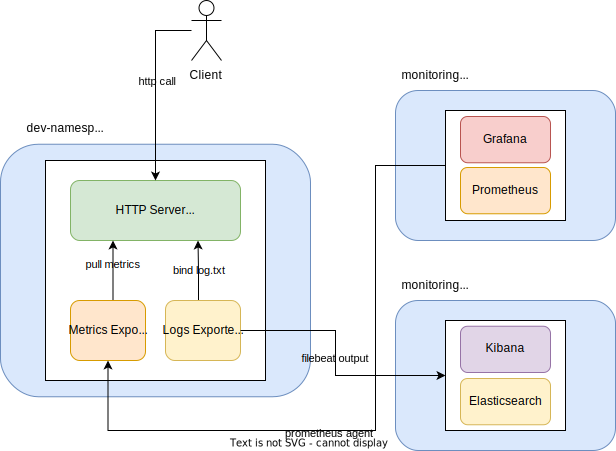

# K8S Sidecars


In ```kubernetes``` there is a feature enabling users to define “sidecar containers” in specifications.
The new feature is intended to help define behavior for helper containers in multi-container pods that might assist in
configuration, networking, log and metrics collection, and so on.

In this project we are going to set up a http server. Furthermore, we are going to add
prometheus metrics exporter and elk logs exporter into app deployed pod to add ```monitoring``` and ```observability```
for our server.

## schema

In the following image you can see the relationship diagram between containers. Our goal is
to export logs and metrics of the http server in order to monitor these data in ```elk``` and ```grafana```.


